# ಇ-Karನಾಟಕ
ಇ-Karನಾಟಕ is a website where users can explore Karnataka's artistic legacy. Our website is a comprehensive sanctuary for those eager to explore, learn the vibrant artforms of Karnataka .

The website offers options to search ,learn ,explore cultures that define Karnataka.
The website offers videos lectures, tutorials ,reading materials and well documented reading materials for all the artforms that are part Karnataka .This website will be a sanctuary for art enthusiasts.
The website offers user specific feeds and suggestions based on previous interactions
## Instalation and Running the Project

# To Start backend
 in the project directory  run 
 ### `cd src/Pythonfiles/`
 install the dependancies
 ### `pip3 install requirements.txt`
 run the backend server 
  ### `python Loginserver.py`

# To Run the App

### create a file called "ApiKey.js" in the "src" folder  and put  put following content 
<i>const  apikey="your api key";
module.exports={apikey};</i>
##run the react app in the local server by typing the following command in the project directory 

`npm start`

app screenshots
### home page
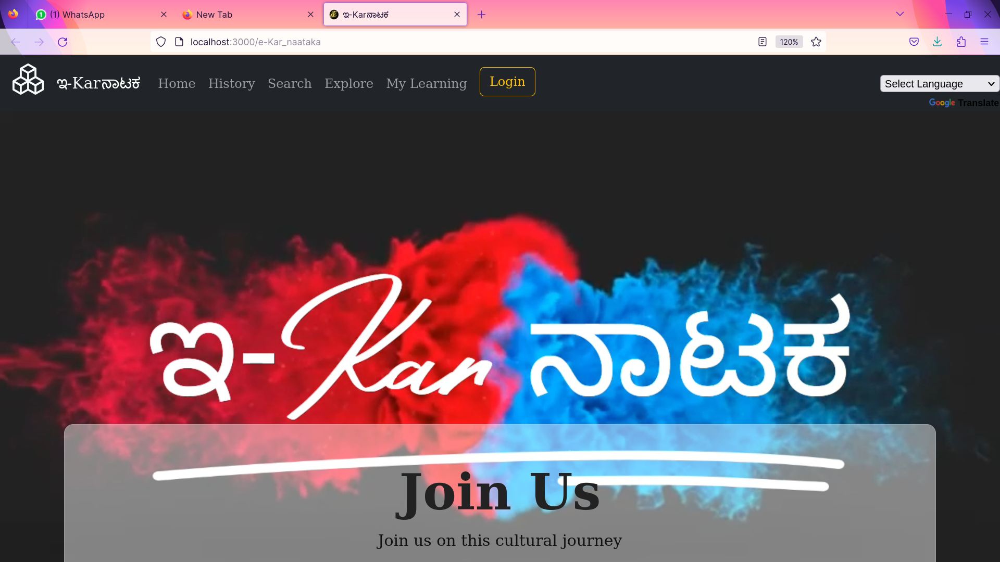

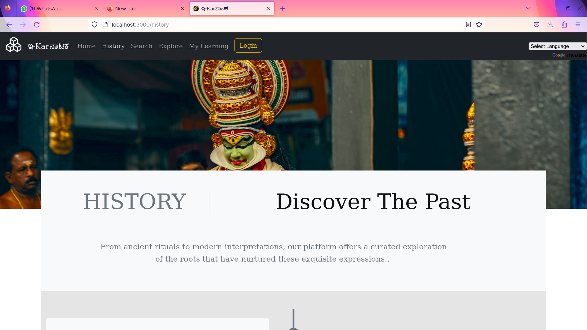
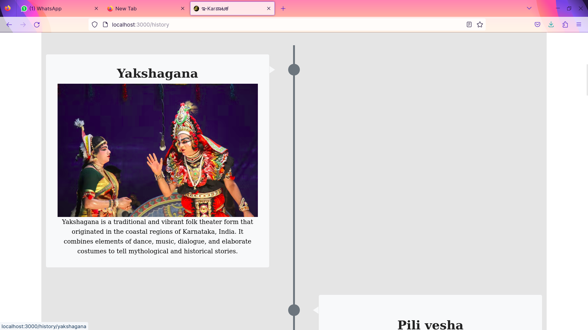
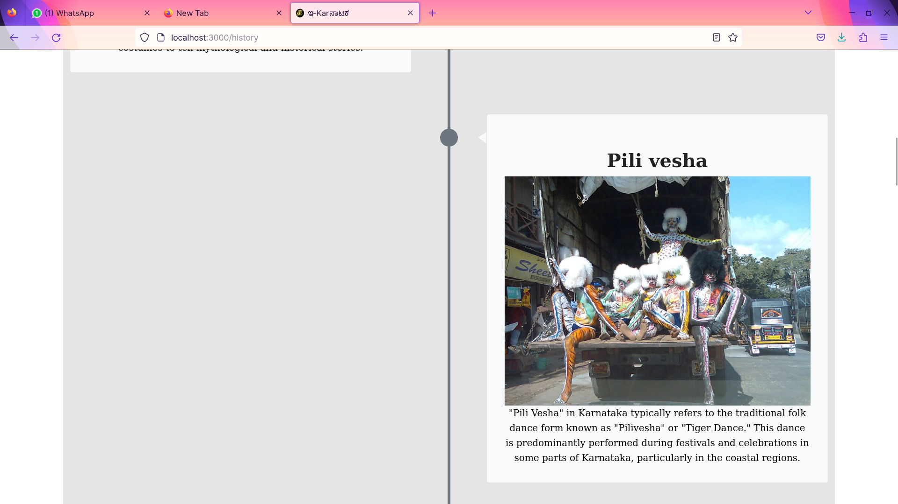
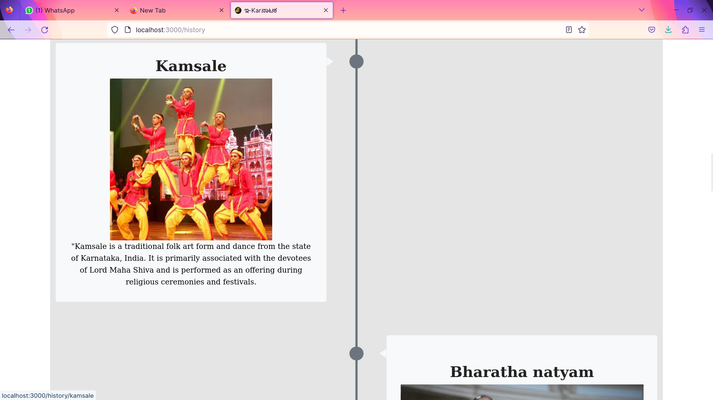
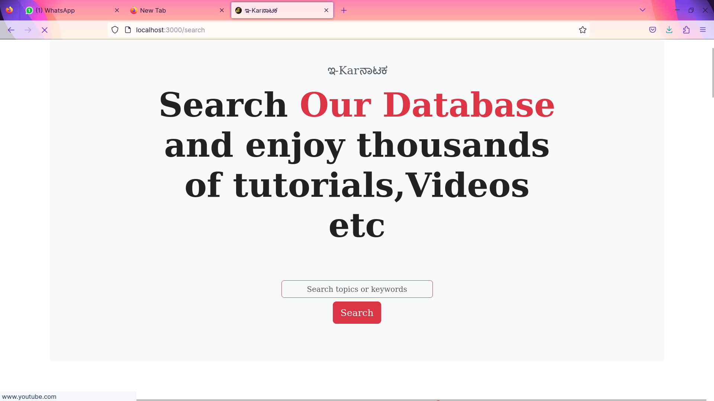
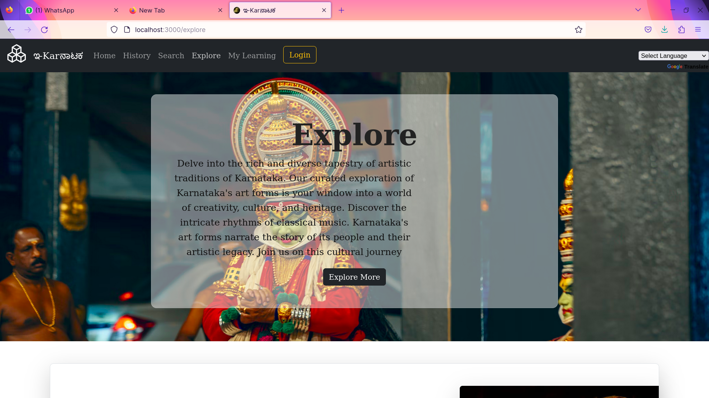
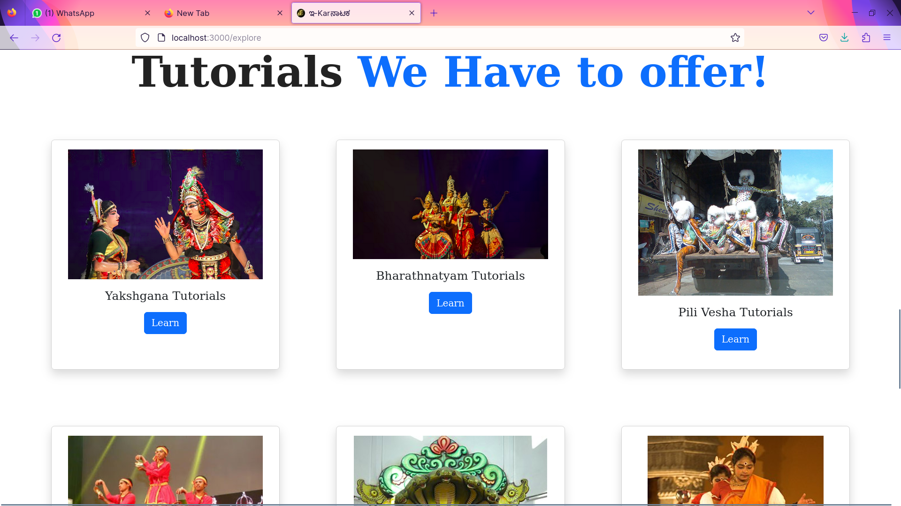
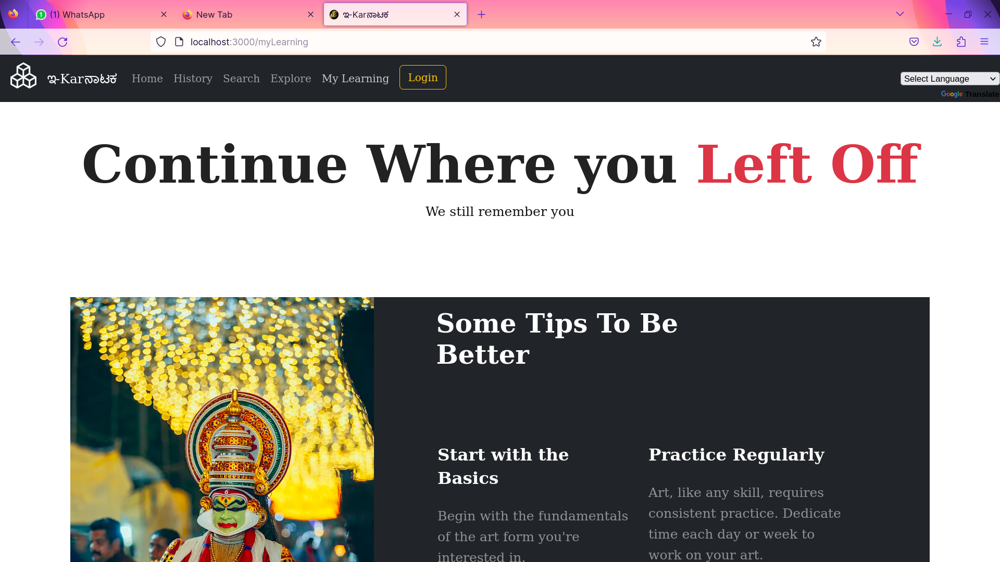
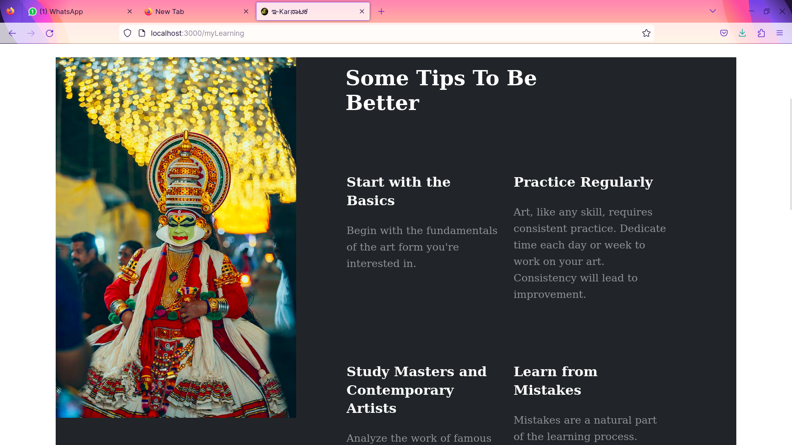
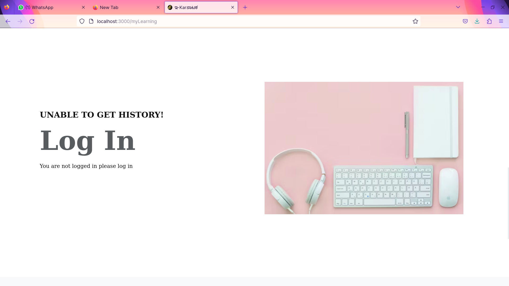
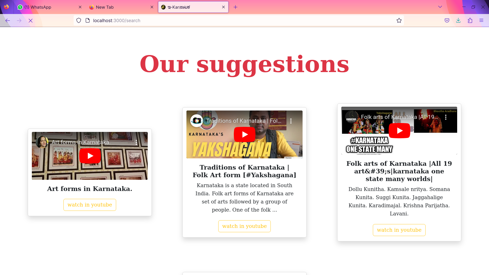
### supports more than 50 languages

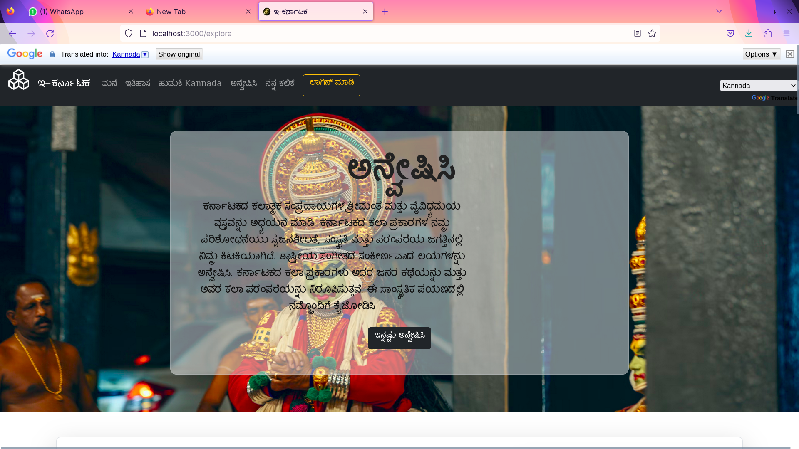

